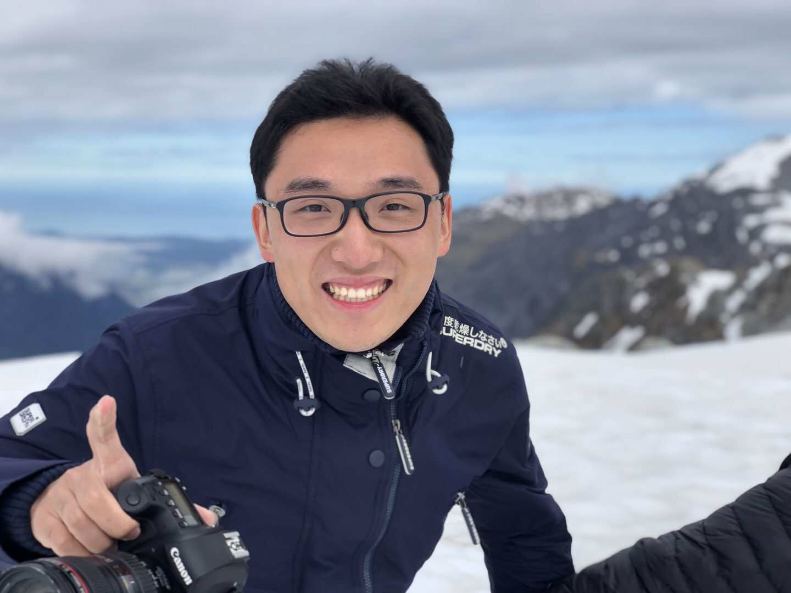

# Jerry Ge

Machine Learning Group @ [Arm](https://www.arm.com)  

**Email:** [jerry.ge@arm.com](mailto: yuzhouge1996@gmail.com)  
**Office:** 120 Rose Orchard Way, San Jose, CA 95134  

  
[\[GitHub\]](https://github.com/Jerry-Ge) [\[LinkedIn\]](https://www.linkedin.com/in/jerry-ge-12b840124/) [\[Youtube\]](https://www.youtube.com/channel/UC7wD7_RN5nadknEpfWDjthQ) [\[Twitter\]](https://twitter.com/jerry_ge)

Welcome to my personal space! I'm currently working on various machine learning technologies at [Arm](https://www.arm.com).

### Areas of expertise

*   Computer Architecture
*   Machine Learning Accelerators
*   [MLIR](https://mlir.llvm.org/)/LLVM
*   Compiler Development

Besides my daily work, I enjoy filmmaking and learning all kinds of sciences and technologies including but not limited to:

*   Neuroscience: How does our brain work?
*   Physics: Quantum and Astrophysics
*   Abstract Algebra: To study the building blocks of our universe

### Personal Notes:

*   [Reinforcement Learning](https://learnings-1.gitbook.io/reinforcement-learning/)
*   [Testing MD](./test.md)

Copyright © 2023 Jerry Ge. All rights reserved.